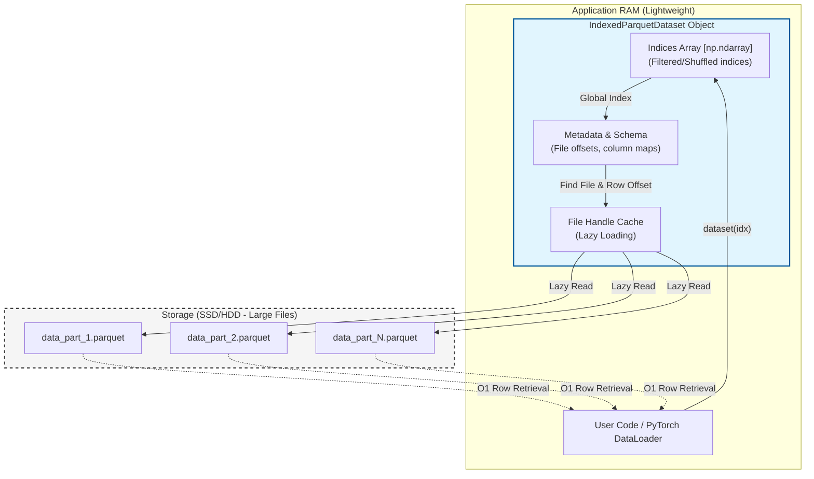

<p align="center">
  
</p>

<p align="center">
  
  
  
</p>

# Indexed Parquet Dataset


High-performance O(1) random access indexer for Parquet datasets in PyTorch and Python.

This library provides an efficient way to handle large-scale datasets stored as multiple Parquet files, allowing for constant-time random access to any row without loading the entire dataset into memory.

## Architecture

The following diagram illustrates how the `IndexedParquetDataset` remains lightweight by only keeping metadata in memory, while the actual data stays on disk:



## Features

- **Fluent API**: Chainable methods for data processing including `shuffle`, `filter`, `alias`, `split`, `limit`, `rename`, `copy`, and `concat`.
- **Computed Columns**: Create new columns or replace existing ones using Python functions (lambdas) via the `alias` method.
- **Explicit Casting**: Change column types on the fly with the `cast` method.
- **Materialization**: Bake all transformations and computations into a real Parquet file via `clone(path)`, eliminating runtime overhead for streaming.
- **Dynamic Schema Evolution**: Support for concatenating datasets with different schemas and automatic type alignment.
- **Linear Scalability**: Indexed access with O(1) complexity regardless of the dataset size.
- **Lazy Loading**: Concurrent safe file access with minimal memory footprint.
- **PyTorch Integration**: Fully compatible with `torch.utils.data.Dataset`.
- **Index Persistence**: Save and load dataset indices to skip the indexing phase in future runs.

## Installation

You can install the package directly from GitHub using pip:

```bash
pip install git+https://github.com/Laeryid/indexed-parquet-dataset
```

## Project Structure

- `src/indexed_parquet/`: Core package directory.
    - `dataset.py`: Implementation of `IndexedParquetDataset` and transformation logic.
    - `indexer.py`: Logic for scanning Parquet files and building global row maps.
    - `schema.py`: Utilities for handling Parquet schemas and data types.
- `tests/`: Comprehensive test suite verifying indexing, transformations, and PyTorch compatibility.
- `pyproject.toml`: Project metadata and dependency definitions.

## Usage

### Basic Initialization

Create a dataset from a folder containing Parquet files:

```python
from indexed_parquet import IndexedParquetDataset

# Scans the folder and builds an internal index
dataset = IndexedParquetDataset.from_folder("./path/to/data")

print(f"Total rows: {len(dataset)}")
print(f"First row: {dataset[0]}")
```

### Fluent API (Transformations)

The dataset supports a chainable API for common data preparation tasks:

```python
dataset = (IndexedParquetDataset.from_folder("./data")
           .filter(lambda x: x["split"] == "train")
           .shuffle(seed=42)
           .alias("text_len", lambda x: len(x["text"])) # Computed column
           .cast("text_len", "int")                    # Explicit casting
           .limit(10000))

# Accessing transformed data
sample = dataset[0] # sample["text_len"] is now available
```

### Advanced Manipulation

#### Copying and Concatenating
Create independent copies or merge multiple datasets with automatic schema alignment:

```python
# Create an independent copy
ds_copy = dataset.copy()

# Vertically concatenate two datasets
# Automatically handles overlapping columns and different aliases
combined_ds = dataset1.concat(dataset2)
```

#### Materialization (Cloning)
To avoid performance degradation when using multiple computed columns or heavy filters, you can "bake" the current state into a new Parquet file:

```python
# to_parquet: just save to disk (export)
dataset.to_parquet("baked_data.parquet")

# clone: save to disk AND return a new dataset instance 
# pointing to the new file (zero-overhead)
fast_dataset = dataset.clone("materialized.parquet")
```

> [!NOTE]
> `clone()` always requires a destination path. It ensures that all Python-based computations (lambdas) are executed once and their results are stored as real values in the new file.
```

### Batch Reading

You can pass a list of indices to retrieve multiple rows efficiently:

```python
batch_indices = [0, 10, 100, 500]
rows = dataset[batch_indices]
```

### Index Persistence

Building an index for millions of rows can take time. You can save the index to a file and load it later:

```python
# Save index
dataset.save_index("my_dataset_index.pkl")

# Load index later (much faster than from_folder)
loaded_dataset = IndexedParquetDataset.load_index("my_dataset_index.pkl")
```

## Technical Requirements

- **PyArrow**: Backend for Parquet file operations.
- **NumPy**: Efficient array management for indexing.
- **PyTorch**: Seamless integration for machine learning pipelines.
- **Pandas**: Schema management and metadata utilities.

## License

This project is licensed under the Apache 2.0 License.
