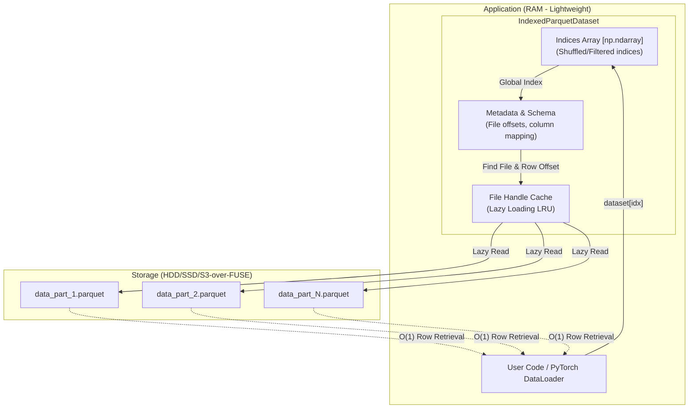

<p align="center">
  
</p>

<p align="center">
  <a href="https://pypi.org/project/indexed-parquet-dataset/"></a>
  
  
  <a href="https://laeryid.github.io/indexed-parquet-dataset/"></a>
</p>

# Indexed Parquet Dataset

**Indexed Parquet Dataset** is a high-performance Python library for **O(1) random access** to massive datasets in Parquet format.

It is specifically optimized for Deep Learning (PyTorch), consumes minimal memory, and supports advanced features such as **Schema Evolution** (working with files of different schemas in a single dataset).

## Key Features

- ⚡ **O(1) Random Access**: Instantly navigate to any row in a multi-gigabyte dataset without scanning files.
- 🔄 **Schema Evolution**: Work with datasets where files have different schemas, missing columns, or renamed fields.
- 📦 **Lazy Loading**: Files are opened only when data is requested. Features an efficient LRU handle cache.
- 🔥 **PyTorch Integration**: Native support for `torch.utils.data.Dataset`, including adaptive `collate_fn` generation.
- 🛠️ **Fluent API**: Method chaining: `shuffle`, `filter`, `alias`, `split`, `limit`, `rename`, `cast`, `map`.
- 💾 **Index Persistence**: Save and fast-load the index from a file.
- 🏗️ **Materialization**: "Bake" all transformations into new Parquet files via `clone()`.

## Architecture

The library remains lightweight, storing only metadata and a row map in RAM:



## Installation

From PyPI:
```bash
pip install indexed-parquet-dataset
```

For PyTorch support:
```bash
pip install "indexed-parquet-dataset[torch]"
```

## Quickstart

### Basic Initialization

```python
from indexed_parquet import IndexedParquetDataset

# Scans the folder and builds a global row index
ds = IndexedParquetDataset.from_folder("./path/to/data")

print(f"Total rows: {len(ds)}")
print(f"First row: {ds[0]}") # {'id': 1, 'text': '...', ...}

# Random access to any row is instant
sample = ds[999_999]
```

### Transformations (Fluent API)

```python
ds = (IndexedParquetDataset.from_folder("./data")
      .filter(lambda x: x["score"] > 0.5)
      .shuffle(seed=42)
      .alias("text_len", lambda x: len(x["text"]))
      .limit(10000))

# Each row now has a virtual 'text_len' column
print(ds[0]["text_len"])
```

### Usage with PyTorch

```python
from torch.utils.data import DataLoader

ds = IndexedParquetDataset.from_folder("./data", auto_fill=True)
train_ds, val_ds = ds.train_test_split(test_size=0.1)

loader = DataLoader(
    train_ds, 
    batch_size=32, 
    shuffle=True, 
    num_workers=4,
    collate_fn=ds.generate_collate_fn(on_none='fill')
)
```

## Documentation

Full documentation is available on [GitHub Pages](https://laeryid.github.io/indexed-parquet-dataset/).

## License

[Apache 2.0 License](LICENSE)
