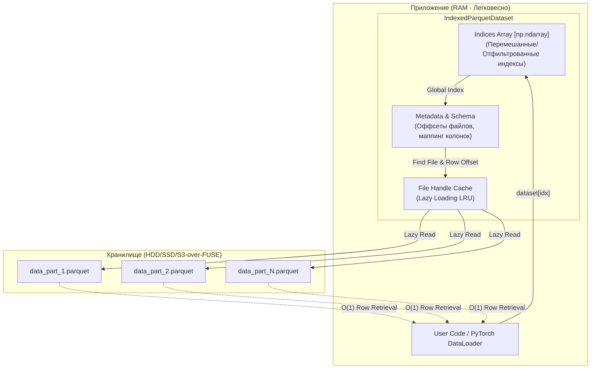

<p align="center">
  
</p>

<p align="center">
  <a href="https://pypi.org/project/indexed-parquet-dataset/"></a>
  
  
  <a href="https://laeryid.github.io/indexed-parquet-dataset/"></a>
</p>

# Indexed Parquet Dataset

**Indexed Parquet Dataset** — это высокопроизводительная библиотека на Python для **O(1) случайного доступа** к огромным наборам данных в формате Parquet. 

Она специально оптимизирована для Deep Learning (PyTorch), потребляет минимум памяти и поддерживает сложные функции, такие как **Schema Evolution** (работа с файлами разных схем в одном датасете).

## Основные фишки

- ⚡ **O(1) Random Access**: Мгновенный переход к любой строке в многогигабайтном датасете без сканирования файлов.
- 🔄 **Schema Evolution**: Работа с наборами данных, где файлы имеют разные схемы, отсутствующие колонки или переименованные поля.
- 📦 **Lazy Loading**: Файлы открываются только при запросе данных. Эффективный LRU-кэш дескрипторов.
- 🔥 **PyTorch Integration**: Нативная поддержка `torch.utils.data.Dataset`, включая генерацию адаптивного `collate_fn`.
- 🛠️ **Fluent API**: Цепочки вызовов: `shuffle` (глобальный или оптимизированный), `filter`, `alias`, `split`, `limit`, `rename`, `cast`, `map`.
- 💾 **Index Persistence**: Сохранение и быстрая загрузка индекса из файла.
- 🏗️ **Materialization**: "Запекание" всех трансформаций в новые Parquet файлы через `clone()`.

## Архитектура

Библиотека остается легковесной, храня в оперативной памяти только метаданные и карту строк:



## Установка

Из PyPI:
```bash
pip install indexed-parquet-dataset
```

Для поддержки PyTorch:
```bash
pip install "indexed-parquet-dataset[torch]"
```

## Быстрый старт

### Базовая инициализация

```python
from indexed_parquet_dataset import IndexedParquetDataset

# Сканирует папку и строит глобальный индекс строк
ds = IndexedParquetDataset.from_folder("./path/to/data")

print(f"Всего строк: {len(ds)}")
print(f"Первая строка: {ds[0]}") # {'id': 1, 'text': '...', ...}

# Случайный доступ к любой строке мгновенный
sample = ds[999_999]
```

### Трансформации (Fluent API)

```python
ds = (IndexedParquetDataset.from_folder("./data")
      .filter(lambda x: x["score"] > 0.5)
      .shuffle(seed=42, rg_buffer=32) # Оптимизированное перемешивание для быстрого I/O
      .alias("text_len", lambda x: len(x["text"]))
      .limit(10000))

# Теперь у каждой строки есть виртуальная колонка 'text_len'
print(ds[0]["text_len"])
```

### Использование с PyTorch

```python
from torch.utils.data import DataLoader

ds = IndexedParquetDataset.from_folder("./data", auto_fill=True)
train_ds, val_ds = ds.train_test_split(test_size=0.1)

loader = DataLoader(
    train_ds, 
    batch_size=32, 
    shuffle=True, 
    num_workers=4,
    collate_fn=ds.generate_collate_fn(on_none='fill')
)
```

## Документация

Полная документация доступна на [GitHub Pages](https://laeryid.github.io/indexed-parquet-dataset/).

## Лицензия

[Apache 2.0 License](LICENSE)
